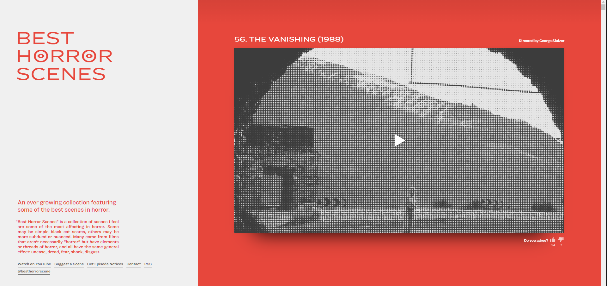

# Best Horrorscenes

## 원본 사이트

https://besthorrorscenes.com/



## 사이트 특징

- [x] 반응형 웹 (small, medium, large) 으로 나누어지는듯?
- [x] medium, large 일때는 2 column
  - [x] 좌측에는 사이트에 대한 설명이 (site header)이 고정
  - [x] 우측에는 사이트에 대한 컨텐츠가 존재 (제목, 동영상, 감독, 좋아요, 싫어요)
  - [x] small일 때는 1 column으로 가장 첫번째가 site header이고, 밑으로는 컨텐츠가 존재
- [ ] 컨텐츠는 (제목, 동영상, 감독, 좋아요, 싫어요)
  - [x] 동영상은 fixed ratio aspect라서 사이즈를 조절하면 동적으로 변환되는 형태임.
  - [x] contents는 여러개의 아이템으로 이루어져 있으며, 하나의 아이템의 중앙에 컨텐츠가 존재.
  - [ ] 컨텐츠의 background는 gradation이 적용되어 있음.
  - [x] 사이트의 타이틀과 설명은 같은 margin 값을 가지고 있는 것으로 추정됨. - 아니었음. width가 고정되어있었음.
- [x] 밑에 링크들은 다른 margin값으로 정렬되어 있는 듯? - 아니었음. width가 고정되어있었음.
- [x] 제목과 설명을 포함하는 것들은 고정된 크기가 잇다. (640px)

## 배운 것들

### Fixed aspect ratio로 div조절하기

이거 엄청 해맸는데, 다른 더편한 왕도가 있다면 좋겠다..

일단 이짓을 하려면 도움을 주기위한 wrapper가 필요한데, 아래와같은 구조가 되야함.

```html
<div class="wrapper">
  <div class="fixed-ratio"></div>
</div>
```

그리고 css로는 다음과같이 먹여야 함.

```scss
.wrapper {
  position: relative;
  width: 100%;
  height: 0px;
  padding-bottom: 56.25%; // 이건 비율이다.
  .fixed-ratio {
    position: absolute; // 이걸 absolute로
    top: 0;
    bottom: 0;
    left: 0;
    right: 0;
    width: 100%;
    height: 100%;
  }
}
```

**_원리_**

- [x] 왜 releative?
- [x] 왜 absolute?
- [x] 왜 padding?
  - 이게 padding-top이나 padding-bottom을 주면서 height를 0으로 주면 padding이 width에 동적으로 변경된다.
    - 내가 이해한 원리로는 height는 무조건 0이되어야할 것같다.
  - 그런데 그러면 안에 들어갈 수 있는 contents의 height가 0이되서 거기에 배치를 할 수가 없는데, 그렇기 때문에 현재 element에서 position을 absolute를 설정해주어야 하는것이다.
    - position: relative를 사용했을 때, 자식이 top(위), right(오른쪽), bottom(아래), left(왼쪽) 속성을 사용해 위치 조절이 가능하다.
    - absolute는 position: static 속성을 가지고 있지 않은 부모를 기준으로 움직인다.
    - 만약 부모 중에 포지션이 relative, absolute, fixed인 태그가 없다면 가장 위의 태그(body)가 기준이 된다.
    - 그렇기 때문에 부모가 padding-top, bottom을 설정해서 크기를 fixed-ratio로 만들어주고, 현재 그냥은 contents로들어갈수 없으므로 부모를 relative로 설정후 자식을 abosulte로 설정하는 것이다.

### Mixin 속성으로 mixin 작성하기

mixin상에서 속성 값등은 문자열 자체를 치환하는 방식으로 구현해야한다. 내가 구현한 ResponsibleChanger의 코드는 다음과 같다.

```scss
@import "include-media";
@mixin responsableChanger($attr, $small, $medium, $large) {
  @include media("<small") {
    #{$attr}: $small;
  }
  @include media(">=small", "<large") {
    #{$attr}: $medium;
  }
  @include media(">=large") {
    #{$attr}: $large;
  }
}
```

`$attr` 속성명을 받아서 문자열 치환해주는 방식이다.

비슷한 예로 calc같은 함수의 인자로 넘겨줄때에도 치환을 해줘야한다.

```scss
.tmp {
  width: calc(100% - #{$smallContentPadding} * 2);
}
```

### Fixed layout

Fixed 자체는 그냥 position을 Fixed로 박아주면 되는데, 문제는 이게 Fixed가되버리면 다른 layout이 그것들과 상호작용하지않고 단독으로 오롯이 존재하게 된다.  
그래서 레이아웃이 망가지는 일이발생하는데, 만약 그런경우에는 그부분을 padding이나 margin을 줘서 확보해주면 된다. 귀찮...  
이 site에서는 좌측에 고정된 width: 600px 등으로 고정되어있으므로, 우측에 layout에 padding-left: 600px을 같이 주었다.

```scss
.header {
  position: fixed;
  width: $largeLeft;
}
.contents {
  padding-left: $largeLeft;
}
```
