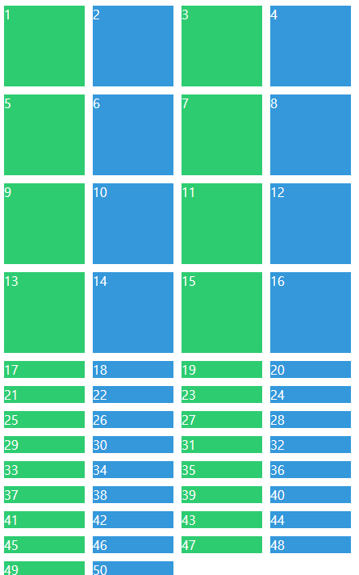
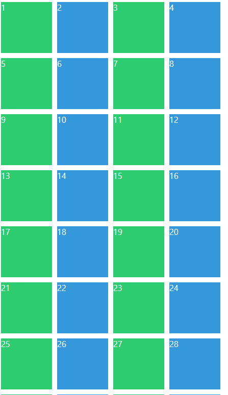
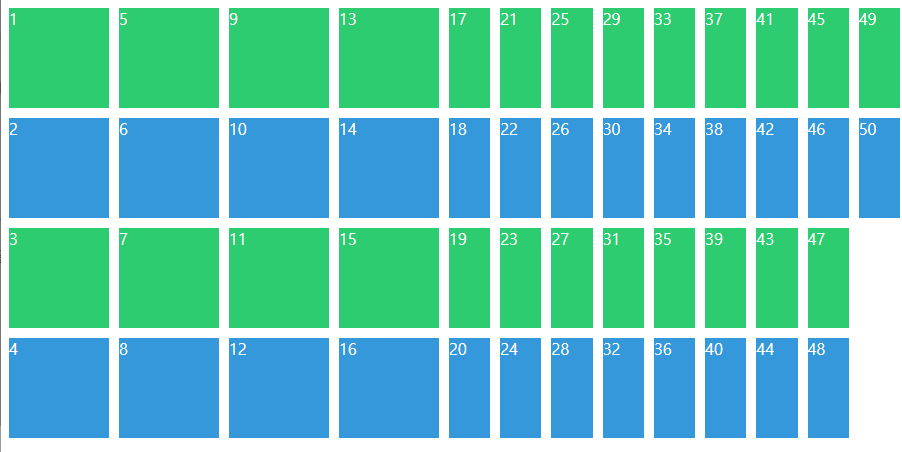
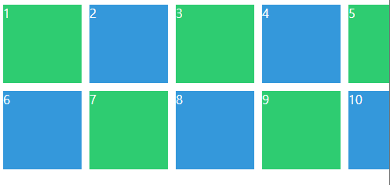
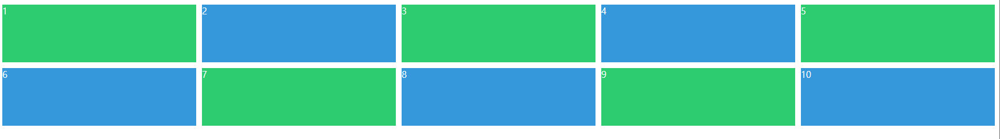
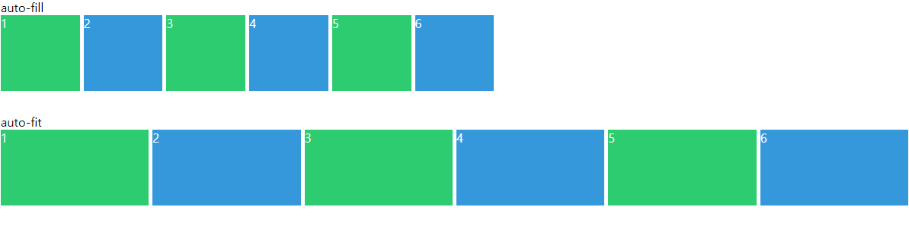

# 2.1 Life Before Grid

flexbox로는 grid 형태를 만들기 어려움.

아래처럼 코드를 짰을 때, 5가 중앙에오지 않고 양쪽으로 흩어짐. 중앙으로 보내기가 어렵다.

```html
<!DOCTYPE html>
<html lang="en">
  <head>
    <meta charset="UTF-8" />
    <meta name="viewport" content="width=device-width, initial-scale=1.0" />
    <link rel="stylesheet" href="grid-styles.css" />
    <title>(S)CSS flexbox</title>
  </head>
  <body>
    <div class="father">
      <div class="child">1</div>
      <div class="child">2</div>
      <div class="child">3</div>
      <div class="child">4</div>
      <div class="child">5</div>
    </div>
  </body>
</html>
```

```css
.father {
  display: flex;
  flex-wrap: wrap;
  justify-content: space-between;
}

.child {
  flex-basis: 30%;
  background: peru;
  font-size: 50px;
  color: white;
  display: flex;
  justify-content: center;
  align-content: center;
  margin-top: 10px;
}

```

# 2.2 CSS Grid Basic Concepts

grid은 대부분 flex랑 비슷한데, 항상 father에 적용됨. 

여기서 각 column 크기를 grid-template-columns로 설정할 수 있어.
그리고 각 column과 row 사이의 간격을 

 - row-gap
 - column-gap
 - gap

으로 설정할 수 있어.
```css
.father {
  display: grid;
}
.father {
  display: grid;
  grid-template-columns: 250px 250px 250px;
  grid-template-rows: 100px 100px 100px;
  gap: 10px;
  /* same as row-gap: 10px; column-gap: 10px; */
}
```

테스트를 위해서 emmet 으로 child를 많이 생성해보자! `div.child{$}*9` 유용하니 기억해두자구


# 2.3 Grid Template Areas

## repeat
그런데 위에 썹놓은거보면 grid의 column과 row만큼 반복되는거 너무거슬리지않니?

이걸 반복해줄 수 있는데 다음과 같이 쓰면 된당.

```css
.father {
  display: grid;
  grid-template-columns: repeat(4, 200px);
  /*same as grid-template-columns: 200px 200px 200px 200px;*/
  grid-template-rows: repeat(4, 300px);
  /*same as grid-template-rows: 300px 300px 300px 300px;*/
}
```

## grid template area

grid template area로는 손쉽게 layout을 디자인할 수 있어. 

예를들어보자. 

주로사용하는 layout을 그리기 위해서 

```css
.father {
  display: grid;
  grid-template-columns: repeat(4, 200px);
  /*same as grid-template-columns: 200px 200px 200px 200px;*/
  grid-template-rows: repeat(4, 200px);
  /*same as grid-template-rows: 300px 300px 300px 300px;*/
  grid-template-areas:
    "header header header header"
    "content content content nav"
    "content content content nav"
    "footer footer footer footer";
}
```
다음과 같이 네이밍을 써주면 그 모양으로 레이아웃을 디자인해줘. 개꿀이지.

주의할 점은 아래와 같이 각 클래스의 layout naming을 디자인해줘야한다는거야. 

grid-area의 속성값으로들어가는건 ***string이 아니라는 점*** 체크해 둬!
```css

.header {
  background-color: #2ecc71;
  grid-area: header;
}
.content {
  background-color: #3498db;
  grid-area: content;
}
.nav {
  background-color: #8e44ad;
  grid-area: nav;
}
.footer {
  background-color: #f39c12;
  grid-area: footer;
}
```

## auto
grid-template-columns 의 속성값으로 auto를 사용할 수 있는데 이 강의로는 잘 이해가안가고 아래의 참고하면 좋을 것 같은 블로그 껄 활용하자.
https://studiomeal.com/archives/533

# 2.4 Rows and Columns

## grid-column-start grid-column-end
이 두 속성은 child에 적용되는 속성으로 grid의 column에 어디서부터 어디까지 해당 child가 차지할지를 정의할 수 있지. 아래의 코드를보자.

```css
.father {
  display: grid;
  gap: 10px;
  grid-template-columns: repeat(4, 100px);
  grid-template-rows: repeat(4, 100px);
}
.header {
  background-color: #2ecc71;
  grid-column-start: 1;
  grid-column-end:2;
}
```
어떤 것을 떠올렸는지는 모르겠지만 위의 코드를 실행해보면 grid-column-start와 end를 적용하기 전과 같을 꺼야. 

그 이유는...

***grid-column-start,grid-column-end 의 속성값들은 line의 번호를 의미하기 때문***

이야 아래의 예를 들어보자면 아래 셀의 번호가 1인 친구는 line 1과 2로 이루어져있지.  
1---2---3---4---5  
|-1-|-2-|-3-|-4-|   
그렇기 때문에 위의 css에서는 1번 cell만을  선택하게 된거야.
따라서 만약 지금 선택한 child가 cell 1과 cell2를 모두 차지하게 하고 싶다면 start를 1로 end를 3으로 해야해.

```css
.father {
  display: grid;
  gap: 10px;
  grid-template-columns: repeat(4, 100px);
  grid-template-rows: repeat(4, 100px);
}
.header {
  background-color: #2ecc71;
  grid-column-start: 1;
  grid-column-end:3;
}
```

이제 area와 똑같은 형태로 만들어 보자. 

```css
.father {
  display: grid;
  gap: 10px;
  grid-template-columns: repeat(4, 100px);
  grid-template-rows: repeat(4, 100px);
}
.header {
  background-color: #2ecc71;
  grid-column-start: 1;
  grid-column-end:5;
}
.content {
  background-color: #3498db;
  grid-column-start: 1;
  grid-column-end:4;
  grid-row-start: 2;
  grid-row-end: 4;
}
.nav {
  background-color: #8e44ad;
  grid-column-start: 4;
  grid-column-end: 5;
  grid-row-start: 2;
  grid-row-end: 4;
}
.footer {
  background-color: #f39c12;
  grid-column-start:1;
  grid-column-end:5;
}
```

# 2.5 Shortcuts

솔직히 위에 표현식은 조금 귀찮아. 그래서 아래와 같이 shortcut으로 쉽게 사용할수 있어. 

## shortcut 1 start와 end 생략

start와 end를 생략하고   
grid-column: {start_value} / {end_value};  
로 쓸수 있어  

```css
.father {
  display: grid;
  gap: 10px;
  grid-template-columns: repeat(4, 100px);
  grid-template-rows: repeat(4, 100px);
}

.header {
  background-color: #2ecc71;
  grid-column: 1 / 5;
}
.content {
  background-color: #3498db;
  grid-column: 1 / 4;
  grid-row: 2 / 4;
}
.nav {
  background-color: #8e44ad;
  grid-column: 4 / 5;
  grid-row: 2 / 4;
}
.footer {
  background-color: #f39c12;
  grid-column:1 / 5;
}
```

## shortcut 2 뒤에서부터 세기

python indexing처럼 -1을 써서 line의 끝까지를 표현할 수 있어. 직관적으로 -2는 마지막에서 한칸 적은것을 표현할 수 있겠지? 아래를 보자.

```css
.header {
  background-color: #2ecc71;
  grid-column: 1 / -1;
}
.content {
  background-color: #3498db;
  grid-column: 1 / -2;
  grid-row: 2 / -2;
}
.nav {
  background-color: #8e44ad;
  grid-column: 4 / -1;
  grid-row: 2 / -2;
}
.footer {
  background-color: #f39c12;
  grid-column:1 / -1;
}
```

## shortcut 3 - span 셀의 개수 세기

이번에는 line이 아니라 셀의 개수를 셀수도 있어. 아까 그걸 아래와 같이 표현할수도 있지.

```css
.header {
  background-color: #2ecc71;
  grid-column: span 4;
}
.content {
  background-color: #3498db;
  grid-column: 1 / -2;
  grid-row: 2/ span 2;
}
.nav {
  background-color: #8e44ad;
  grid-row: 2 / span 2;
}
.footer {
  background-color: #f39c12;
  grid-column: span 4;
}
```

# 2.6 Line Naming

니콜라는 이걸 잘안써~ line에 네이밍하는거야 그냥. 아래와 같이 쓴다는것만 알아둬

```css
.father {
  display: grid;
  gap: 10px;
  grid-template-columns: [first-line] 100px [second-line] 100px [third-line] 100px [fourth-line] 100px [fifth-line];
  grid-template-rows: repeat(4, 100px);
}

.content {
  background-color: #3498db;
  grid-column: first-line / fourth-line;
  grid-row: 2/ span 2;
}
```

# 2.7 Grid Template

## fraction (fr)

fr은 현재 컨테이너 상에서 (코드상에서는 grid) 차지할 수 있는 넓이를 가능한 모두를 사용해서 그 공간을 조각내는 단위야. 일종의 비율이라고 볼수도 있지. 아래 코드를 실행해보면 이해하기 쉬울꺼야. 

```css
.grid {
  display: grid;
  gap: 10px;
  grid-template-columns: repeat(4, 1fr);
  grid-template-rows: repeat(4, 100px);
}
.header {
  background-color: #2ecc71;
}
.content {
  background-color: #3498db;
}
.nav {
  background-color: #8e44ad;
}
.footer {
  background-color: #f39c12;
}
```
이코드를 실행하면 각 영역들이 균등하게 화면을 분할한 것을 확인할 수 있어.  
만약 첫번째열을 더크게 하고싶다면 아래와같이 쓰면된다. 

```css
.grid {
  display: grid;
  gap: 10px;
  grid-template-columns: 3fr 1fr 1fr 1fr;
  grid-template-rows: repeat(4, 100px);
}
```

그리고 fr는 전체가 아니라 할당된 크기를 fraction내는 거야. 아래의 것도 실행해보길 바래. 

```css
.grid {
  display: grid;
  gap: 10px;
  width: 500px;
  grid-template-columns: 3fr 1fr 1fr 1fr;
  grid-template-rows: repeat(4, 100px);
}
```

## fr을 row에 적용할 때는 주의해!

왜냐면 row는 언제나 길이의 제한이 없어서 높이가 없다면 높이를 지정해주지 않아. 아래의 코드를 실행해보면 그 이유를 알 수 있어.

```css
.grid {
  display: grid;
  gap: 10px;
  grid-template-columns: repeat(4, 1fr);
  grid-template-rows: repeat(4, 1fr);
}

```

위의 코드를 적용하려면 아래와 같이 써야할거야. 

```css
.grid {
  display: grid;
  gap: 10px;
  height: 100vh;
  grid-template-columns: repeat(4, 1fr);
  grid-template-rows: repeat(4, 1fr);
}
```

## grid-template를 사용하자.

grid-template 속성은 모든 grid 속성을 사용할 수 있는 shortcut이라고 보면 됨.

```css

.grid {
  display: grid;
  gap: 10px;
  height: 100vh;
  grid-template: 
  "header header header header" 1fr
  "content content content nav" 2fr
  "footer footer footer footer" 1fr / 1fr 1fr 1fr 1fr;
}
.header {
  background-color: #2ecc71;
  grid-area: header;
}
.content {
  background-color: #3498db;
  grid-area: content;
}
.nav {
  background-color: #8e44ad;
  grid-area: nav;
}
.footer {
  background-color: #f39c12;
  grid-area: footer;
}
```

아! 참고로 ***grid-template은 repeat이 적용되지않아.***  

위의 코드를 설명하자면
"name name name name" row-size
"name name name name" row-size
"name name name name" row-size / column-size column-size column-size column-size 
라고 생각하면 되겠네

# 2.8 Place Items

## justify-items
justify-items는 수평적으로 아이템을 놓는 법에 관하여 정의하는 속성이야.

- stretch 이 값은 가로 세로 바닥 위를 전부 가득채우는 형태야.
- start는 시작지점에서 배치되고 
- center이건 중앙에서 
- end 이건 끝에서 배치됨.

## align-items
align-items는 수직적으로 아이템을 놓는 법에 관하여 정의하는 속성이야. 

- stretch 이 값은 가로 세로 바닥 위를 전부 가득채우는 형태야.
- start는 시작지점에서 배치되고 
- center이건 중앙에서 
- end 이건 끝에서 배치됨.

그럼 이건 어떻게 배치될까?

```css

.grid {
  display: grid;
  gap: 10px;
  height: 100vh;
  grid-template: 1fr 1fr 1fr 1fr / 1fr 1fr 1fr 1fr;
  justify-items: center;
  align-items: center;
}
.header {
  background-color: #2ecc71;
}
.content {
  background-color: #3498db;
}
.nav {
  background-color: #8e44ad;
}
.footer {
  background-color: #f39c12;
}
```

## place-items (shortcut for <align-items> <justify-items>)
얘는 shortcut이야. 
아래처럼 사용할 수 있어.
첫번째는 수직의 아이템 배치를 두번째는 수평의 아이템 배치를 설정할 수 있지.

```css
.grid {
  display: grid;
  gap: 10px;
  height: 100vh;
  grid-template: 1fr 1fr 1fr 1fr / 1fr 1fr 1fr 1fr;
  place-items: start end;
}
```
이건 수직으로는 시작지점에 수평으로는 끝지점에 배치된당.

# 2.9 Place Content

## justify-content
앞에서 했던건 item 즉 셀 중에 즉 셀 안에 있는 것들을 어떻게 배치하는지에 관한 내용이었어. 여기서 말하는 content는 ***grid 전체를 말하는 거야***

```css
.grid {
  background: black;
  display: grid;
  gap: 10px;
  height: 100vh;
  grid-template-columns: repeat(4, 100px);
  grid-template-rows: repeat(4, 100px);
  justify-content: center;
}
```
이걸 실행해보면 grid 전체가 중간으로 옮겨간 모습을 볼 수 있을 꺼야. 
이전에 flex 에서 사용할 수 있었던 속성들이 있었지. 그것들을 마찬가지로 사용할 수 있어.

 - space-around
 - space-between
 - space-evenly
 - start (default)
 - end
 - stretch (이건 먼지 잘모르겠음)

## align-content
이건 수직적으로 움직이는거야. 위랑 마찬가지니까 생략하도록할께. 수직적으로 적용하는건 항상 ***height가 없다면 정상적으로 작동하지 않을 수 있다는 사실을 잊지마***


## stretchdp 에 대한 이해

질문 
```
align-content: stretch 때문에 grid의 row가 늘어났다기보다
grid-template-rows 를 repeat(4, 1fr) 로 설정했을때 이미 height 설정값 만큼
늘어나는 것 같은데 아닌가요? ㅠㅠ
```

답변

```
명시된 높이가 있다면 해당수치가 고정되는것같습니다

grid-template-rows: repeat(4, auto); 를 주고나서 stretch를 적용하면 늘어나고
space-around같은 값을 적용하면 텍스트높이만큼만 적용되네요
```

# 2.10 Auto Columns and Rows

## align-self, justify-self

align-self와 justify-self는  align-items와 justify-items를 해당 child에만 적용할 수 있는 방법이야. 즉 grid container가 아니라 child에 적용하는 방식이야. 

```css
.grid {
  background: black;
  display: grid;
  gap: 10px;
  height: 100vh;
  grid-template-columns: repeat(4, 100px);
  grid-template-rows: repeat(4, 100px);
}
.header {
  background-color: #2ecc71;
  color: white;
  align-self: end;
  justify-self: center;
}
```

### shortcut 
place-self를 쓰면 이 두가지를 동시에 쓸 수 있어. 이것도 위에서 했던 place items 와 place content랑 같아.
```css
.header {
  background-color: #2ecc71;
  color: white;
  place-self: end center;
}
```

## 
아래와 같은 상황을 가정하자.

css는 다음과같고
```css
.grid {
  display: grid;
  gap: 10px;
  grid-template-columns: repeat(4, 100px);
  grid-template-rows: repeat(4, 100px);
}
.item:nth-child(odd) {
  background-color: #2ecc71;
  color: white;
}
.item:nth-child(even) {
  background-color: #3498db;
  color: white;
}
```

html은 다음과같아.

```html
  <body>
    <div class="grid">
      <div class="item">1</div>
      <div class="item">2</div>
      <div class="item">3</div>
      <div class="item">4</div>
      <div class="item">5</div>
      <div class="item">6</div>
      <div class="item">7</div>
      <div class="item">8</div>
      <div class="item">9</div>
      <div class="item">10</div>
      <div class="item">11</div>
      <div class="item">12</div>
      <div class="item">13</div>
      <div class="item">14</div>
      <div class="item">15</div>
      <div class="item">16</div>
      <div class="item">17</div>
      <div class="item">18</div>
      <div class="item">19</div>
      <div class="item">20</div>
    </div>
  </body>
```

이걸 그대로작성해보면 4x4 grid를 초과한 경우 사이즈가 100px이 아니라 글자 크기가 된것을 확인할 수 있을 거야. 

그 이유는 우리는 현재 20개의 element를 가지고 있는데 grid 상에서는 단 16개만 정의가 되어 있기 때문이지.



즉 row 4개에 대해서만 설정되어있기 때문이야.

이걸 해결하기 위해서 grid-template-rows를 사용할꺼야.

만약 너가 추가로 row를 사용하게 된다면 아래와 같은 설정을 하면 된당.

```css
.grid {
  display: grid;
  gap: 10px;
  grid-template-columns: repeat(4, 100px);
  grid-template-rows: repeat(4, 100px);
  grid-auto-rows: 100px;
}
```


완성!

만약 모두가 같다면 grid-template-rows를 설정하지 않아도 되겠지? 

만약 새로운 element가 늘어날 때, row가 아니라 column을 넣고 싶다면 grid-auto-flow를 사용해.  
grid-auto-flow는 기본값이 row지만 column으로 설정하면 column방향으로 늘릴 수 있어.

```css
.grid {
  display: grid;
  gap: 10px;
  grid-template-columns: repeat(4, 100px);
  grid-template-rows: repeat(4, 100px);
  grid-auto-flow: column;
}
```



# 2.11 minmax

minmax는 말그대로 min과 max를 설정하는거야. 

만약 최소한 100px보다 크게 설정하고, 최대 1fr의 값을 가지는 column을 설정하고 싶다면 아래와 같이 설정하면 된당. 

```css
.grid {
  display: grid;
  gap: 10px;
  grid-template-columns: repeat(10, minmax(100px, 1fr));
  grid-template-rows: repeat(4, 100px);
}
```
이렇게하면 100px보다 줄수없지만, 커질때는 끊임없이 늘어나.



작으면 이렇게 100px 이하로 내려가지 않지만, 



커지면 이렇게 쫙늘어나게된다.

# 2.12 auto-fit auto-fill
auto-fill은 아래와 같이 빈공간을 만드는데 이 빈 공간에는 전부 grid가 들어가 있어. 

auto fit은 반면에 창 사이즈맞게 좍 늘리는 형태로 만들어져. 
이건 한 컬럼상에서 몇개의 item이 들어올지 예상할숭벗을때 유용할꺼야. 





### Live Server를 사용할 대 버그 발생

Live Server를 사용할 때 first-child와 last-child가 먹지 않는 문제가 발생해서 오랬동안 해맸다.

이유는 Live Server에서 임의로 html을 수정해서 그런데, html의 body마지막 부분에 script태그를 삽입하고, 단순하게 tag로 감싸지지 않은 text는 <text> 태그로 바꾸어 랜더링을 진행하였기 때문이다. 

즉 .grid:first-child 쿼리에는 `<text>auto-fill</text>` 가 잡혔고,

.grid:last-child 쿼리에는 `<script>...</script>` 가 잡혀서 정상적으로 query selector가 안먹힌 모양이다.

