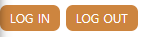

# 3.0 CSS Preprocessors and Set up

SCSS는 preprocessor야. 어떤 scss code를 컴파일해서 일반적인 css code로만드는거지.

원래 사용되는거는 Sass였어. Sass는 SCSS와 같은 방식으로 사용할 수 있는데 다른 syntax를 가지고 있어서 ...
잘모르겠어 나중에 찾아봐야지.

## preprocessor

기존의 preprocessor로는 stylus가 있어.  
https://stylus-lang.com

또는 lesscss.org 가 있지.  
SCSS는 이제거의 업계표준이 되가고 있어.  
SCSS는 CSS를 programming language 처럼 만들어.

## 필요한 것들

### gulp

이건 compile하거나 transform 해주는 node js 패키지야.  
새로운 코드를 오래된 코드로 바꾸거나 SCSS, SASS를 일반적인 CSS로 바꿔야지.

다음을 실행해서 gulp를 설치하자.

보니까 따라하기 위해서는 이것저것 설치할게 많은 것같다.

package.json아래에 설치되어 있는 것들을 설치하고 gulpfile을 실행시키기 위해서는 아래와 같이 터미널을 실행시키면된다.

```console
npm i && npm dev run
```

대충해서 이렇게 한것까지는 좋은데 에러가좀나는듯? 나중에 gulp나 js를 다시한번 자세히 공부하는시간을 가져야할것같다. ㅠ

### trouble shooting - UnauthorizedAccess

power shell에서 execution policy가 restricted 로 설정되어 있어서 그럼.

powershell을 관리자 관한으로 연 뒤  
`executionpolicy`  
를 실행해보면 Restricted 라는 값이 나올 거임.  
`set-executionpolicy unrestricted`  
를 실행해서 권한을 풀어주면 된다.

참고 블로그 : https://cishome.tistory.com/138

# 3.1 Variables and Nesting

## variable

variable은 가장 중요한 styles을 저장하고 싶을 때나, 색을 저장하고 싶을때 사용해.

이제 새로운 file을 만들어보자. 예를들자면 `srsc/scss/_variables.scss` 야.  
여기서 \_로 시작하는 파일은 css로 바꾸지 말아달라고 요청하는 것과 같아.

이 파일에 새로운 변수를 선언하고 사용해보자.

```scss
$bg: crimson;
```

```scss
@import "_variables";
body {
  background: $bg;
  a {
    color: blue;
  }
}
```

그럼 색이 변하는 것을 확인할 수 있을꺼야.

## Nesting

Nesting은 css의 계층적인 관계를 좀더 보기 쉽고 짜기 쉽게 작성할 수 있게 만들어 줘. 예를들어보자면 다음과 같아.

```css
h2 {
  color: $bg;
}
.box {
  margin-top: 20px;
}
.box h2 {
  color: blue;
}
.box button {
  color: red;
}

.box:hover {
  background-color: green;
}
```

위의 코드는 잘 작동하지만 솔직히 여기저기 소스코드가 떨어져있어서 보기 힘들기도 해. 반면 scss는 다음과같이 계층적구조를 쉽게 표현할 수 있어.

```scss
@import "_variables";
h2 {
  color: $bg;
}
.box {
  margin-top: 20px;
  &:hover {
    color: green;
  }
  h2 {
    color: blue;
  }
  button {
    color: red;
  }
}
```

둘다 같은 표현방식으로 표현되지만 super cool하지.

# 3.2 Mixins

Mixins를 배우기 위해서 새로운 파일을 만들어보자. 간편하게 `src/scss/_mixins.scss` 정도면 되겠네.

여기서 mixins는 아래와같이 적용할 수 있어.

```scss
// src/scss/_mixins.scss
@mixin link($color) {
  text-decoration: none;
  display: block;
  color: $color;
}
```

```scss
// src/scss/styles.scss
@import "_variables";
@import "_mixins";
a {
  @include link(green);
}
```

mixins는 위처럼 마치 함수와 같이 사용할 수 있어. 마치 program같지.
아래와 같이 활용할 수 있을거야.

```scss
@import "_variables";
@import "_mixins";

a {
  &:nth-child(odd) {
    @include link(blue);
  }
  &:nth-child(even) {
    @include link(red);
  }
}
```

이렇게 작성하게되면 더 적은량의 코드로 멋진 css를 작성할 수 있을 뿐 아니라 css의 길이까지 최적화시켜줘. (공통된 부분을 하나의 css로 빼준다던가 하는등의)

거기다가 조건문도 가지고 있어!

```scss
//styles.scss
@import "_variables";
@import "_mixins";

a {
  &:nth-child(odd) {
    @include link("odd");
  }
  &:nth-child(even) {
    @include link("even");
  }
}
```

```scss
@mixin link($word) {
  text-decoration: none;
  display: block;
  @if $word == "odd" {
    color: blue;
  } @else {
    color: red;
  }
}
```

와 근데 이건 진짜 수퍼 쿨하긴한데; 재사용가능성을 엄청나게 높여주네.

# 3.3 extends

extend는 말 그대로 다른 코드를 확장 하거나 너가 코드를재사아요하고 싶을 때 사용하면 편해.

```html
<body>
  <a href="">Log in</a>
  <button>Log Out</button>
</body>
```

요기에 class를 넣거나, 새로운 짓을 하지 않구 말이야.

일단 a와 button에 같은 것을 적용할 건데 알다시피 a에는 text-decoration이 붙어있고, button에는 border가 기본으로 들어가 있지. 하지만 같은 스타일을 적용하고싶어!

```scss
// src/scss/_buttons.scss
%button {
  border-radius: 7px;
  font-size: 12px;
  text-transform: uppercase;
  padding: 5px 10px;
  background-color: peru;
  font-weight: 500;
  color: white;
  font-family: inherit;
}
```

이렇게하면 extend를 사용할수있어. 그리고 이걸 사용하는 법은

```scss
// src/scss/styles.scc
@import "_buttons";

a {
  @extend %button;
  text-decoration: none;
}

button {
  @extend %button;
  border: none;
}
```

이렇게하면 둘이 같은 스타일을 가지게 된당.


